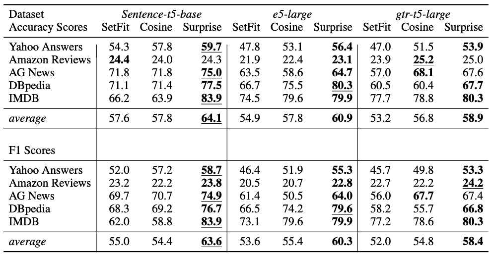
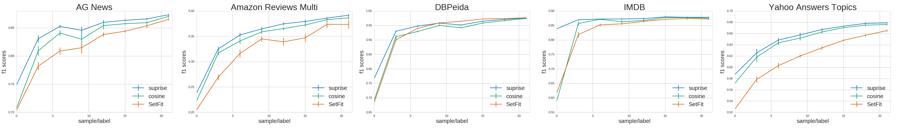

# Surprise Similarity - a context-aware similarity score for vector embeddings

The surprise similarity takes advantage of contextual information to produce a similarity score for embedded objects that more closely mirrors human perception.  Substituting the surprise similarity for common similarity scores (e.g. cosine similarity) has proven to improve results in NLP classification and clustering tasks. Furthermore we use an effective and efficient procedure for fine-tuning sentence-transformer models; we have found this to be valuable in many practical scenarios, e.g. few-shot classification, clustering, and document ranking/retrieval.

## The paper: 
Find an in-depth discussion of surprise similarity definition and results [here](http://arxiv.org).

## Installation 
Get started with:
```
python -m pip install surprise-similarity
```

## Use

### Document ranking: a toy example
See surprise_similarity/notebooks/simple_example.ipynb to see details of this example.

In this example we illustrate the difference between the similarity of words as measured by the cosine similarity vs the surprise score.  We rank the words in the vocabulary given by `english_words_alpha_set` (shipped with the package https://pypi.org/project/english-words/) based on their similarity to the word `dog` via cosine similarity (`surprise_weight = 0`) and surprise score (`surprise_weight = 1`) using the following:
```
from english_words import english_words_alpha_set
vocabulary = list(english_words_alpha_set)
dog_cosing_similarity_df = similarity.rank_documents(queries=['dog'],
                                documents=vocabulary,
                                surprise_weight=0,
                                sample_num_cutoff=None,
                                normalize_raw_similarity=False,
                                )

dog_surprise_similarity_df = similarity.rank_documents(queries=['dog'],
                                documents=vocabulary,
                                surprise_weight=1,
                                sample_num_cutoff=None,
                                normalize_raw_similarity=False,
                                )
```                                
Then, if we want to check the rankings of a few examples we can run:
```
my_dogs_name = 'Jude'
example_words = ['the', 'potato', 'my', 'Alsatian', 'furry', 'puppyish', my_dogs_name]
print(Cosine ranks:)
print(dog_cosing_similarity_df[dog_cosing_similarity_df['documents'].isin(example_words)].to_markdown())
print(Surprise ranks:)
print(dog_surprise_similarity_df[dog_surprise_similarity_df['documents'].isin(example_words)].to_markdown())
```
finding:
```
Cosine ranks:
documents      dog
      the 0.852129
   potato 0.850233
       my 0.850161
 Alsatian 0.849615
    furry 0.833391
 puppyish 0.829942
     Jude 0.783955

Surprise ranks:
documents      dog
 Alsatian 0.999325
    furry 0.995553
 puppyish 0.987653
   potato 0.987412
      the 0.979651
       my 0.973795
     Jude 0.639304
```
And finally, we can fine-tune the underlying sentence embedding model to learn my dogs name:
``` 
similarity.train(keys=["dog", 'pet'], queries=[my_dogs_name, my_dogs_name], min_its=30, lr_factor=1)
```
which results in the following cosine-similarity ranking:
```
documents      dog
     Jude 0.929732
   potato 0.929431
       my 0.926398
      the 0.920728
    furry 0.911322
 Alsatian 0.908444
 puppyish 0.904361
 ```
### Classification
The surprise-score encapsulates the contextual element of human perception and significantly improves the classification performance on
zero- and few-shot document classification tasks relative to pure cosine similarity and other popular methods. In the table below we show a zero-shot comparison for several datasets using several underlying embedding models.  One can see that the surprise-similarity consistently outperforms a pure cosine-similarity classifier, as well as the [SetFit](https://github.com/huggingface/setfit) pipeline.
<p align="center">

</p>
Furthermore, this performance persists in the few-shot scenario as shown below:
<p align="center">

</p>
All of the above results (and more!) are discussed in full detail [here](http://arxiv.org).


To get started for yourself, check out the quick-start instructions below.  For more detail, please see the notebook surprise/similarity/notebooks/few_shot_classification.ipynb which steps through how to use the SurpriseSimilarity class to fine-tune and perform a few-shot classification experiment on the `Yahoo! Answers` dataset.

Start by getting your dataset and assembling two lists of input samples and their corresponding (text) labels:
```
from datasets import load_dataset
import random
ds = load_dataset("yahoo_answers_topics")
df_train = ds["train"].to_pandas()
df_test = ds["test"].to_pandas()

# We need to map the integer label to its corresponding text:
# e.g. 1 --> 'Science & Mathematics'
int_to_text_target = {
    i: v
    for i, v in enumerate(ds["train"].features['topic'].names)
}
label_set = list(int_to_text_target.values())
test_targets = [
    int_to_text_target[i] for i in df_test['topic']
]
test_input_output = list(zip(df_test["question_title"].to_list(), test_targets))

train_targets = [
    int_to_text_target[i] for i in df_train['topic']
]
train_input_output = list(zip(df_train["question_title"].to_list(), train_targets))

# Here we randomly grab 50 samples, which would be 5 samples per label if balanced.
# Surprise-similarity performs well even on unbalanced training sets.
train_unbalanced_few_shot = random.sample(train_input_output, 50)
```

The essentials for fine-tuning are:
```
from surprise_similarity import SurpriseSimilarity
ss = SurpriseSimilarity()
ss.train(
    keys=[item[0] for item in train_unbalanced_few_shot],
    queries=[item[1] for item in train_unbalanced_few_shot],
)
```
This will fine-tune the classifier, which can then be used for prediction via:
```
from sklearn.metrics import f1_score, accuracy_score
predictions = ss.predict(
    keys=[item[0] for item in test_input_output],
    queries=list(set([item[1] for item in test_input_output])),
)
f1_result = f1_score([it[1] for it in test_input_output], predictions, average="weighted", zero_division=0)
acc_result = accuracy_score([it[1] for it in test_input_output], predictions)
print("F1 score: ", f1_result)
print("Accuracy score: ", acc_result)
```
For this dataset we get around 65% for both accuracy and F1 score.